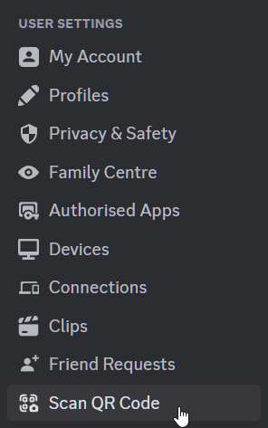
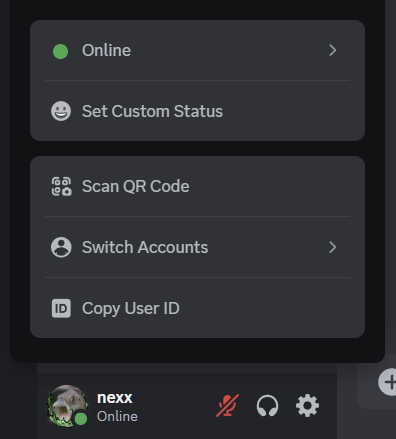

# Login with QR

Allows you to login to another device by scanning a login QR code, just like on mobile!

|  |  |  |
| ------------------------------------------------------------------------------- | --------------------------------------------------------------------------- | -------------------------------------------------------------------------------- |
| Scan QR Code button in the My Account settings tab                              | Scan QR Code tab bar item in the settings tab bar                           | Scan QR Code menu item in the simplified user popout                             |
|                            |                                                                             |                                                                                  |
| Authorization using webcamera                                                   |                                                                             |                                                                                  |

## Installation

Install using the official [Vencord documentation](https://docs.vencord.dev/installing/custom-plugins/)

<!-- 

  
OR

Use [Equicord](https://github.com/Equicord), a fork of Vencord, which has the plugin built-in!

 -->
