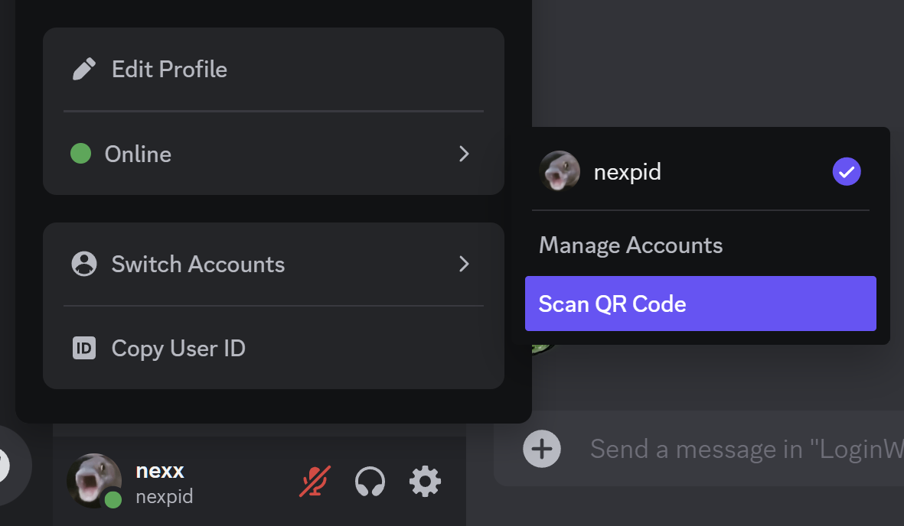

# Login with QR

Allows you to login to another device by scanning a login QR code, just like on mobile!

|  |  |  |
| ----------------------------------------------------------------- | --------------------------------------------------------------------------- | ----------------------------------------------------- |
| Scan QR button in the My Account tab                              | Scan QR menu item in the simplified user popout                             | Authorization using webcamera                         |

## Installation

Install using the official [Vencord documentation](https://docs.vencord.dev/installing/custom-plugins/)

<!-- 

  
OR

Use [Equicord](https://github.com/Equicord), a fork of Vencord, which has the plugin built-in!

 -->
