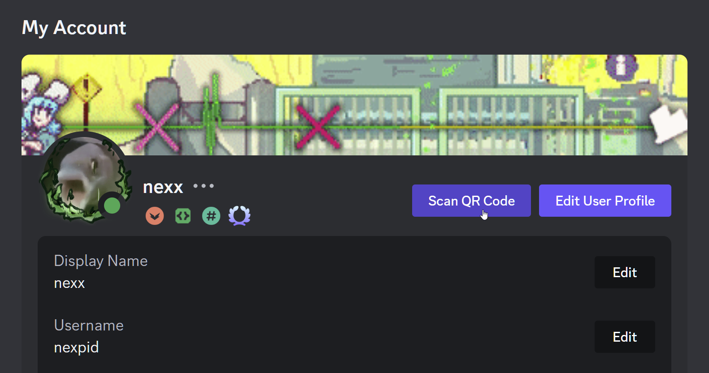

# Login with QR

Allows you to login by scanning a Discord login QR code on desktop!

|  |  |
| ---------------------------------------------------------------------- | ------------------------------------------------------------ |
| Scan QR code button in the My Account tab                              | Authorization using webcamera                                |

## Installation

Install using the official [Vencord documentation](https://docs.vencord.dev/installing/custom-plugins/)

<!-- 

  
OR

Use [Equicord](https://github.com/Equicord), a fork of Vencord, which has the plugin built-in!

 -->
